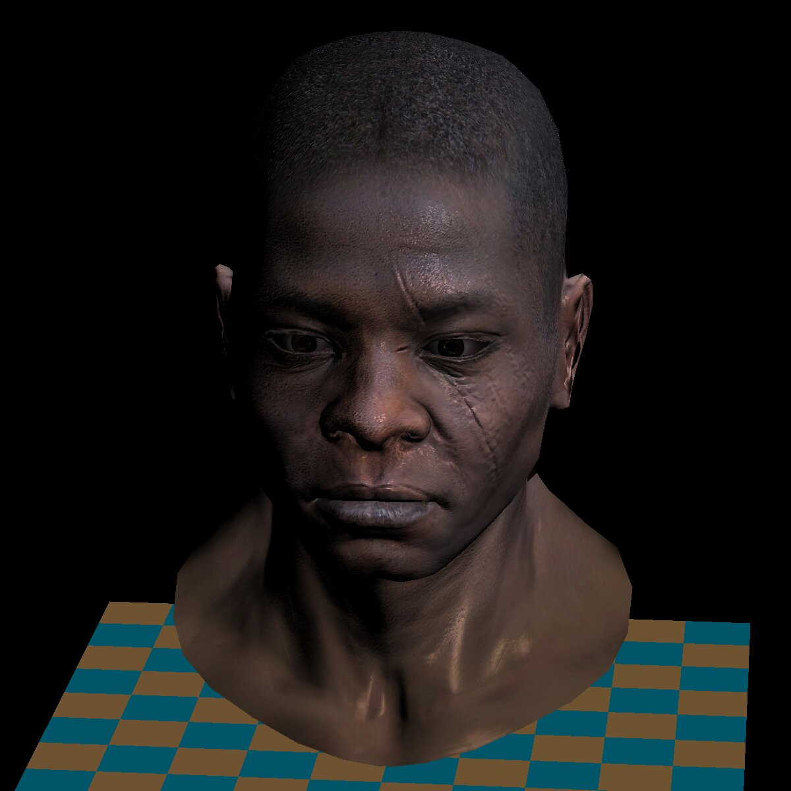

# TinyRenderer Implementation
Hello, this is my own Timyrenderer implemetation and I wrote it following these tutorials
[Ssloy's tutorials](https://github.com/ssloy/tinyrenderer/wiki)

## What did I use?
Generic Makefile: [https://github.com/mbcrawfo/GenericMakefile/blob/master/cpp/Makefile](https://github.com/mbcrawfo/GenericMakefile/blob/master/cpp/Makefile)
Initial import: [https://github.com/ssloy/tinyrenderer/tree/909fe20934ba5334144d2c748805690a1fa4c89f](https://github.com/ssloy/tinyrenderer/tree/909fe20934ba5334144d2c748805690a1fa4c89f)

## Wanna run it?
You just need to clone this repository and have the ```g++``` compiler and the ```make``` comand to use the Makefile provided

```sh
Make
Make run
```
This will give you a TGA image

##  Some examples




